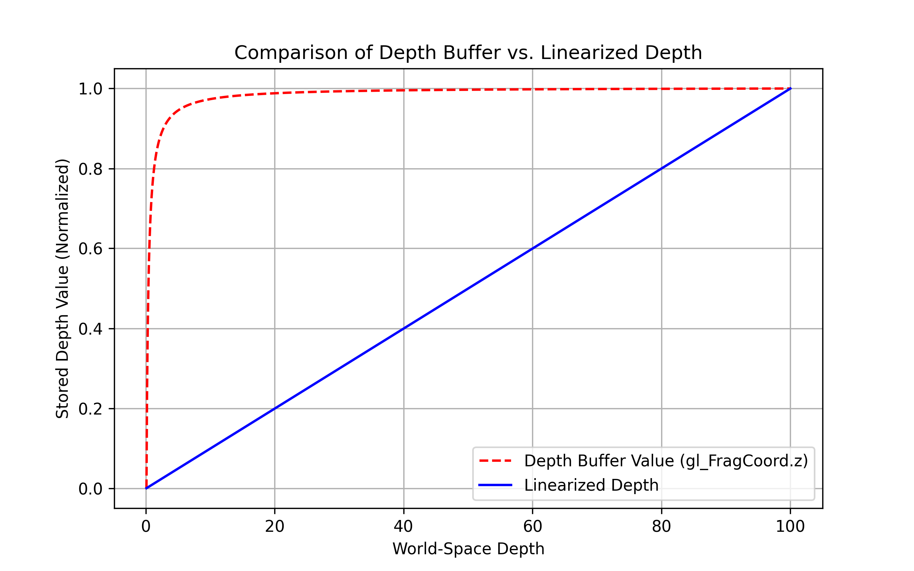

# Understanding Depth Buffer and Linearized Depth

## Introduction

In 3D graphics, depth information is crucial for rendering correct visibility and handling occlusions. However, the way depth is stored in a **depth buffer** (also known as a Z-buffer) is not linear, which can cause issues when using depth values in shading calculations.

This document explains how depth is stored in the depth buffer, why it is **non-linear**, and how to **linearize** it for correct calculations.

## Depth in Clip Space

When rendering a scene using **perspective projection**, the depth value stored in the depth buffer is based on the **clip space Z value**, which is transformed through the perspective divide:

$$ z_{clip} = \frac{A \cdot z_{eye} + B}{z_{eye}} $$

Where:
- $z_{clip}$ is the depth value stored in the depth buffer (`gl_FragCoord.z`).
- $z_{eye}$ is the actual depth in eye space (distance from the camera).
- $A$ and $B$ are constants derived from the near and far clipping planes.

This transformation causes depth values to be **highly compressed near the camera** and **less precise further away**, leading to depth precision issues (z-fighting).

## Linearizing Depth

Since depth values stored in the depth buffer are non-linear, they need to be **linearized** when used for shading effects, such as fog or screen-space ambient occlusion (SSAO). The correct formula to linearize depth is:

$$ z_{linear} = \frac{2.0 \cdot near \cdot far}{far + near - z_{clip} \cdot (far - near)} $$

This transformation maps the stored depth value back to a linear range where:
- **Objects at the near plane (closest to the camera) have values close to 0.**
- **Objects at the far plane (furthest from the camera) have values close to 1.**

### GLSL Implementation

Below is a GLSL function that performs depth linearization using uniforms `u_near` and `u_far` for the near and far clip planes:

```glsl
#version 430 core

uniform float u_near;
uniform float u_far;

float LinearizeDepth(float depth) {
    float z = depth * 2.0 - 1.0; // Transform [0,1] depth to [-1,1] NDC
    return (2.0 * u_near * u_far) / (u_far + u_near - z * (u_far - u_near));
}
```

This function takes the depth value from `gl_FragCoord.z` (which is in the [0,1] range) and converts it into a linear depth value based on the near and far clipping planes.

## Visualization

The following graph illustrates the difference between **stored depth (gl_FragCoord.z) and linearized depth**:



- **Red Dashed Line:** Represents the depth buffer value, which is curved due to perspective projection.
- **Blue Line:** Represents the linearized depth, which follows a straight line.

This visualization highlights how depth compression occurs in perspective projection, emphasizing why **linearization is necessary** for correct shading and post-processing effects.

## Conclusion

Understanding how depth is stored and how to linearize it is crucial for many rendering techniques. Using linearized depth ensures **accurate shading**, **better precision**, and **correct post-processing effects**.
